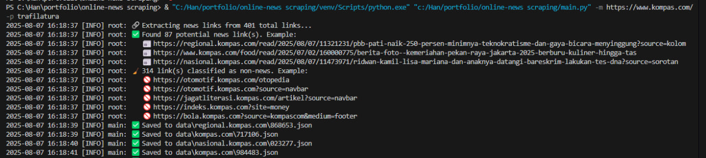

# NewsSniffer 📰🤖

NewsSniffer is an automated news scraping system designed to extract and clean news articles from various media websites.

## Features

- 🕵️ Extract all article links from a **base media link** (homepage, category, etc.)
- 🧠 Uses **Machine Learning (ML)** to predict which links are real news articles
- 📰 Scrape a **single article** with `-n` (news mode)
- ⚙️ Choose between multiple **content processors** using `-p`
- 🧹 Automatically **cleans content and titles** using configurable regex (see `cleaner/regex.json`)
- 🗂️ Stores data as structured JSON inside the `data/` folder, organized per media domain

## Quick Start

### 1. Clone the repo:

```bash
git clone https://github.com/fabiann227/news-sniffer.git
```
```
cd news-sniffer
```

### 2. Install dependencies:

```
pip install -r requirements.txt
```

### 3. Run in media mode (to crawl links and scrape automatically):
```
python main.py -m https://www.detik.com -p trafilatura
```

### 4. Run in news mode (to extract a single article):
```
python main.py -n https://www.detik.com/some-article -p newspaper
```
## Output data newspaper

```json
[
  {
    "url": "https://travel.detik.com/travel-news/d-8049772/transportasi-alternatif-untuk-pariwisata-helikopter",
    "processed_by": "newspaper",
    "title": "Transportasi Alternatif untuk Pariwisata: Helikopter",
    "published_date": "2025-08-07 15:30:46",
    "content": "Berwisata atau menikmati keindahan suatu destinasi memang punya banyak caranya. Salah satunya, dengan helikopter.\n\nSaat ini belum banyak yang menggunakan helikopter buat liburan, tapi peminat di Indonesia cukup menjanjikan. Sudah pasti, anggaran berlibur dengan helikopter lebih mahal, tapi pengalaman spesial menjadi hadiahnya.\n\nSebagai salah satu perusahaan transportasi udara, khsususnya helikopter, Whitesky Aviation, mengakomodasi permintaan tersebut.\n\nSCROLL TO CONTINUE WITH CONTENT\n\nChief Commercial Officer Whitesky Aviation, Ari Nurwanda, mengatakan transportasi helikopter dalam ekosistem pariwisata itu semakin berkembang.\n\nADVERTISEMENT\n\n\"Kita sejak tahun 2022 atau 2023 lalu itu kita co-branding dengan Kemenpar (Kementerian Pariwisata), kita contributing ke pariwisata, partisipasi dengan pariwisata. Untuk kerja sama juga kita dengan beberapa hotel, lalu beberapa kota di sekitar Jakarta,\" kata Ari usai konferensi pers Heli Expo Asia (HEXIA) 2025 di Cengkareng Heliport, Tangerang, Rabu (6/8/2025).\n\n\"Hotel juga kita bisa bikin seperti paket lah. Jadi umpamanya mereka bikin menginap di sana dapat satu services joyflight Jakarta gitu,\" dia menambahkan.\n\nAri juga menyebutkan permintaan helikopter sebagai moda transportasi dalam berwisata biasanya banyak di-charter oleh perorangan dan peminatnya cukup besar.\n\n\"Keperluan personal ya.. itu untuk pariwisata cukup lumayan ada. Kalau untuk bisnis itu kan beda segmen, tapi kalau untuk personal itu biasanya untuk tourism,\" kata jawab Ari.\n\nSeperti yang kita tahu, dewasa ini di destinasi seperti Bali atau Lombok helikopter sudah banyak dijadikan moda transportasi. Mengutip detikBali, helikopter digunakan di kawasan tersebut oleh wisatawan saat terkendala cuaca dan kondisi tertentu.\n\nMeski harganya cukup fantastis, tetapi minat menggunakan helikopter di sana cukup populer.\n\n\"ini buka wisata sultan sebenarnya, cuma kan tamu kita (di sini) punya karakter yang berbeda-beda. Ada yang middle up dan (posisinya) dia harus mengejar pesawat, case-nya banyaklah. Kalau dia pakai fast boat mungkin tidak bisa segera sampai sehingga dia menggunakan helikopter,\" ujar Ketua Indonesian Hotel General Manager Association (IHGMA) NTB, Lalu Kusnawan.",
    "authors": [
      "Muhammad Lugas Pribady"
    ],
    "top_image": "https://akcdn.detik.net.id/api/wm/2025/08/06/konferensi-pers-heli-expo-asia-hexia-di-cengkareng-heliport-tangerang-rabu-682025-1754474459110_169.jpeg?wid=54&w=650&v=1&t=jpeg",
    "tags": [
      "transportasi helikopter",
      "pengalaman berwisata",
      "wisata helikopter"
    ],
    "meta_data": {
      "description": "Berwisata atau menikmati keindahan suatu destinasi memang punya banyak caranya. Salah satunya, dengan helikopter.",
      "originalTitle": "Transportasi Alternatif untuk Pariwisata: Helikopter",
      "og": {
        "type": "article",
        "site_name": "detikTravel",
        "title": "Transportasi Alternatif untuk Pariwisata: Helikopter",
        "image": {
          "identifier": "https://akcdn.detik.net.id/api/wm/2025/08/06/konferensi-pers-heli-expo-asia-hexia-di-cengkareng-heliport-tangerang-rabu-682025-1754474459110_169.jpeg?wid=54&w=650&v=1&t=jpeg",
          "type": "image/jpeg",
          "width": 650,
          "height": 366
        },
        "description": "Berwisata atau menikmati keindahan suatu destinasi memang punya banyak caranya. Salah satunya, dengan helikopter.",
        "url": "https://travel.detik.com/travel-news/d-8049772/transportasi-alternatif-untuk-pariwisata-helikopter"
      },
      "fb": {
        "app_id": 187960271237149,
        "admins": 100000607566694
      },
      "viewport": "initial-scale = 1.0, user-scalable = no, width=device-width, height=device-height, maximum-scale=1.0",
      "copyright": "detikTravel",
      "p": {
        "domain_verify": "2057b86bf61e5a346e22a380c6fecf89"
      },
      "robots": "max-snippet:-1, max-image-preview:large",
      "googlebot-news": "index, follow",
      "googlebot": "index, follow",
      "kanalid": "2-1024-1381-1382",
      "articleid": 8049772,
      "articletype": "singlepage",
      "articledewasa": "dewasatidak",
      "articlehoax": "default",
      "createdate": "2025/08/06 18:11:18",
      "publishdate": "2025/08/07 15:30:46",
      "contenttype": "singlepagenews",
      "platform": "desktop",
      "hl_nhl_wp": "nonheadline-0",
      "hl_nhl_kanal": "nonheadline-0-2-1024",
      "videopresent": "No",
      "author": "Muhammad Lugas Pribady",
      "genreauto": "timeless",
      "keywords": "transportasi helikopter,wisata helikopter,pengalaman berwisata,cengkareng heliport,heli expo asia ( hexia ) 2025,ihgma,indonesian hotel general manager association,detikbali,joyflight,ntb,jakarta,kementerian pariwisata,whitesky aviation,pesawat,gitu,keindahan,boat,cuaca,udara,transportasi helikopter,helikopter,asia,peminat,moda transportasi,khsususnya helikopter,pariwisata,transportasi,lalu kusnawan,sultan,ari nurwanda",
      "thumbnailUrl": "https://akcdn.detik.net.id/community/media/visual/2025/08/06/konferensi-pers-heli-expo-asia-hexia-di-cengkareng-heliport-tangerang-rabu-682025-1754474459110_169.jpeg?w=650",
      "article": {
        "author": "https://www.facebook.com/DetikTravel",
        "publisher": "https://www.facebook.com/DetikTravel"
      },
      "pubdate": "2025-08-07T15-30-46Z",
      "twitter": {
        "card": "summary_large_image",
        "site": {
          "identifier": "@detikTravel",
          "id": "@detikTravel"
        },
        "creator": "@detikTravel",
        "description": "Berwisata atau menikmati keindahan suatu destinasi memang punya banyak caranya. Salah satunya, dengan helikopter.",
        "image": "https://akcdn.detik.net.id/api/wm/2025/08/06/konferensi-pers-heli-expo-asia-hexia-di-cengkareng-heliport-tangerang-rabu-682025-1754474459110_169.jpeg?wid=60&w=650&v=1&t=jpeg"
      },
      "dtk": {
        "acctype": "acc-detiktravel",
        "kanalid": 1382,
        "articleid": 8049772,
        "articletype": "singlepage",
        "articledewasa": "dewasatidak",
        "articlehoax": "default",
        "createddate": "2025/08/06 18:11:18",
        "publishdate": "2025/08/07 15:30:46",
        "createddateunix": 1754478678000,
        "publishdateunix": 1754555446000,
        "contenttype": "singlepagenews",
        "platform": "desktop",
        "videopresent": "No",
        "author": "Muhammad Lugas Pribady",
        "genreauto": "timeless",
        "keywords": "transportasi helikopter,wisata helikopter,pengalaman berwisata,cengkareng heliport,heli expo asia ( hexia ) 2025,ihgma,indonesian hotel general manager association,detikbali,joyflight,ntb,jakarta,kementerian pariwisata,whitesky aviation,pesawat,gitu,keindahan,boat,cuaca,udara,transportasi helikopter,helikopter,asia,peminat,moda transportasi,khsususnya helikopter,pariwisata,transportasi,lalu kusnawan,sultan,ari nurwanda",
        "thumbnailUrl": "https://akcdn.detik.net.id/community/media/visual/2025/08/06/konferensi-pers-heli-expo-asia-hexia-di-cengkareng-heliport-tangerang-rabu-682025-1754474459110_169.jpeg?w=650",
        "status": 1
      },
      "apple-mobile-web-app-capable": "yes"
    }
  }
]
```


## Sample LinkExecutor



